# UNI-verse : AI Powered Student Communication App📱🎓  
**Connecting Students.**

[](https://flutter.dev/)
[](https://firebase.google.com/)
[](https://cloudinary.com/)
[](LICENSE)
[]()
[]()

---

## 📱 Overview

**UNI-verse** is a mobile-first app built to connect university students by providing a centralized platform for information sharing, community support, and engagement. It features social functionalities, AI-powered chatbot support, secure login, and a clean, user-friendly interface. Perfect for universities aiming to enhance campus communication.

---
## 👨‍💻 Developed By


  ###  Hafsa Waseem
      
### Sadia Athar
    
###  Maaz Bin Hassan

  

## 🚀 Features

### 🔍 Lost and Found  
- Report, browse, and post lost/found items  
- Add item details with images  
- Comment and help others find their items
- **AI-Based Categorization**: Automatically categorizes items like *electronics, ID cards, clothes, documents*, etc., based on text content  

### 👥 Peer Assistance  
- Ask or offer academic/non-academic help  
- Like and comment system  
- **AI Topic Tagging**: Automatically tags posts related to subjects like *programming, mathematics, engineering* into categories like *CS, Mathematics, Engineering*, etc.  
- Builds a supportive student network  

### 📊 Survey Lounge  
- Post surveys  
- Get instant feedback from students
- Supports multiple question types
- Link included

### 📢 Event & Job Announcements  
- Post or explore campus events and job openings  
- Easy apply or RSVP feature  
- Smart filtering and search
- Location included  

### 🤖 AI Chatbot  
- Instantly answers campus-related queries  
- Built using    

### 👤 User Profiles  
- Google Sign-In and profile customization  
- Add degree program , semester and work experience  
- Profile picture and display name management  

### ❤️ Like & Comment  
- Like posts and reply to discussions  
- Real-time updates  
- Threaded comments  

### 🔔 Notifications  
- Push notifications via Firebase Cloud Messaging  
- Real-time alerts for comments, likes, events, and more  

### 🔐 Authentication & Security  
- Google Sign-In  
- Two-Factor Authentication (2FA)  
- Secure with Firebase Auth and Firestore Rules  

---

## 🧠 AI-Based Categorization

- **Lost and Found**: Automatically classifies reported items using Natural Language Processing (NLP) into categories like:
  - Electronics
  - Documents
  - Clothing
  - Others

- **Peer Assistance**: AI scans question content to detect domain and auto-assigns categories like:
  - Computer Science (e.g., programming, coding)
  - Mathematics (e.g., algebra, calculus)
  - Engineering (e.g., circuits, mechanics)

This helps in better post discovery, organization, and faster response from relevant peers.

---

## 🧑‍💻 Tech Stack

| Layer         | Technology                     |
|---------------|---------------------------------|
| Frontend      | Flutter (Dart)                 |
| Backend       | Firebase (Firestore, Auth, FCM, Storage) |
| AI/ML         | Pretrained LLMs by Hugging face |
| Media Storage | Cloudinary                     |
| Notifications | Firebase Cloud Messaging (FCM)  |

---

## 🖼️ Screenshots

<p float="left">
 
  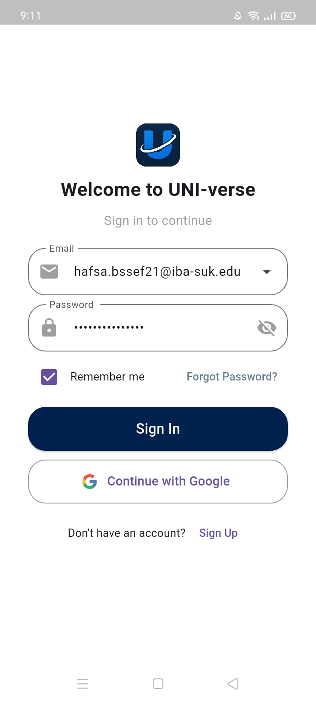
   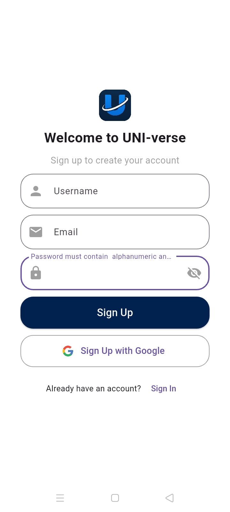
       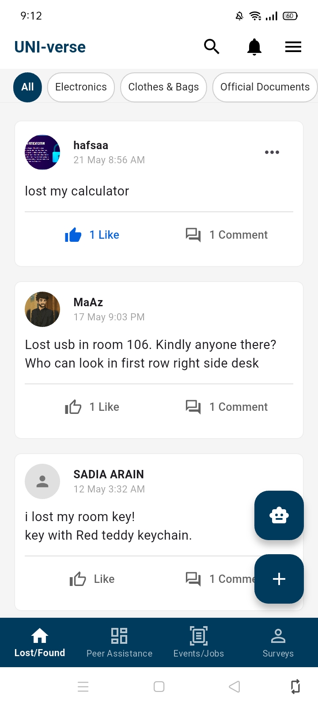
</p>

<p float="left">
  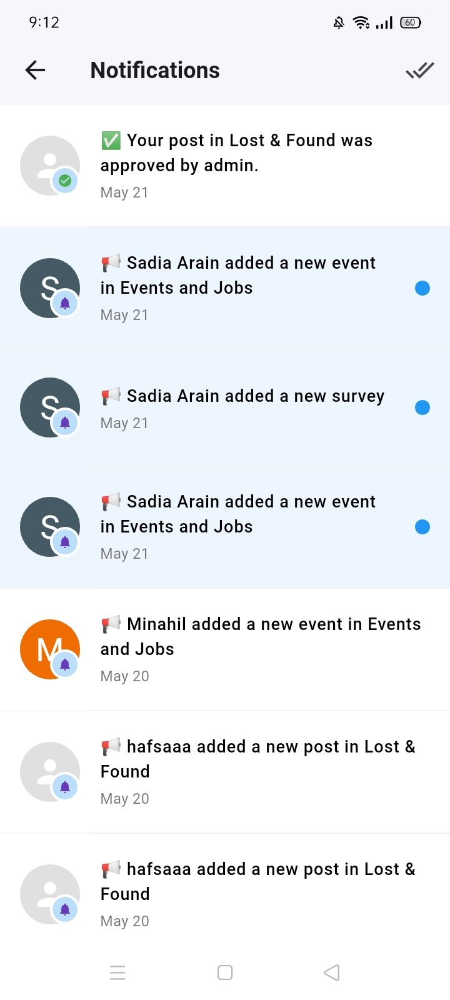
  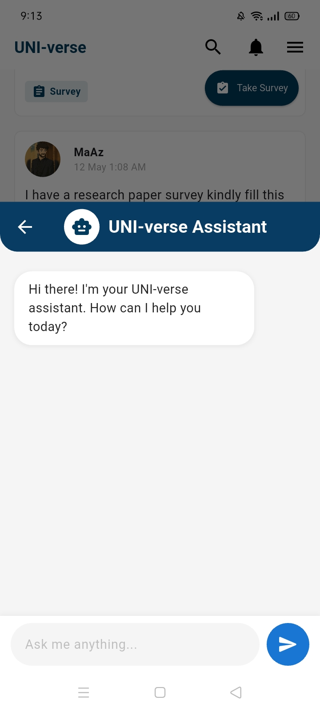
   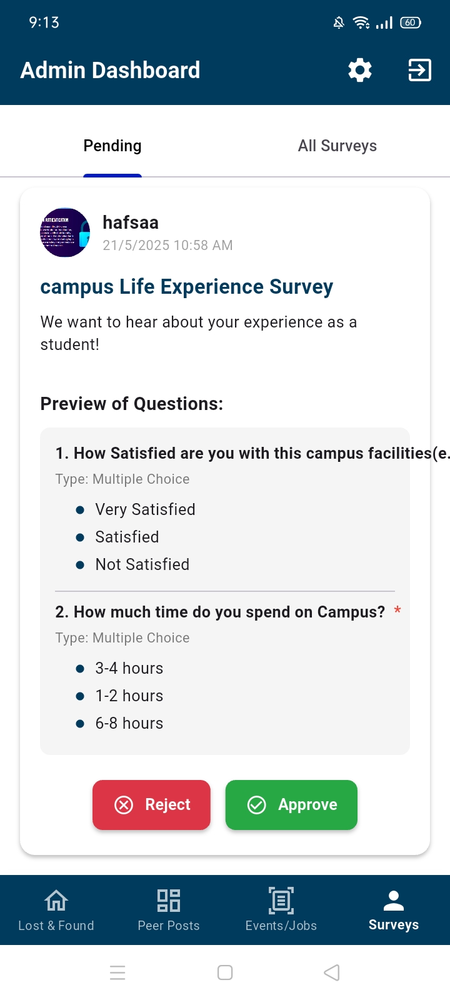
</p>

<p float="left">
  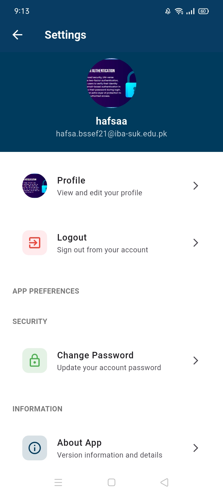
  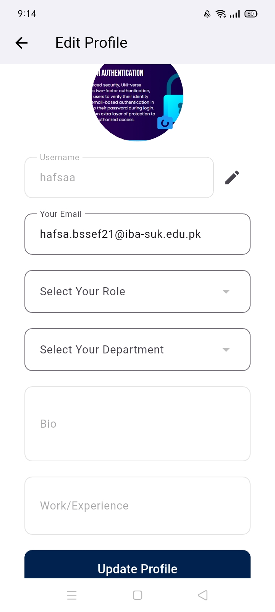
   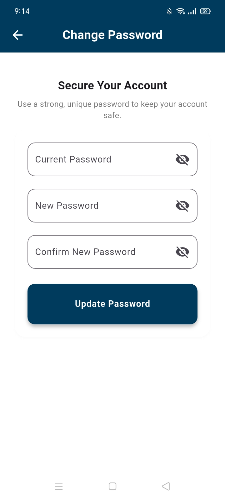
</p>
<p float="left">
  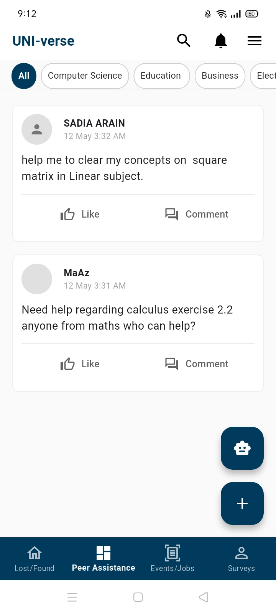
  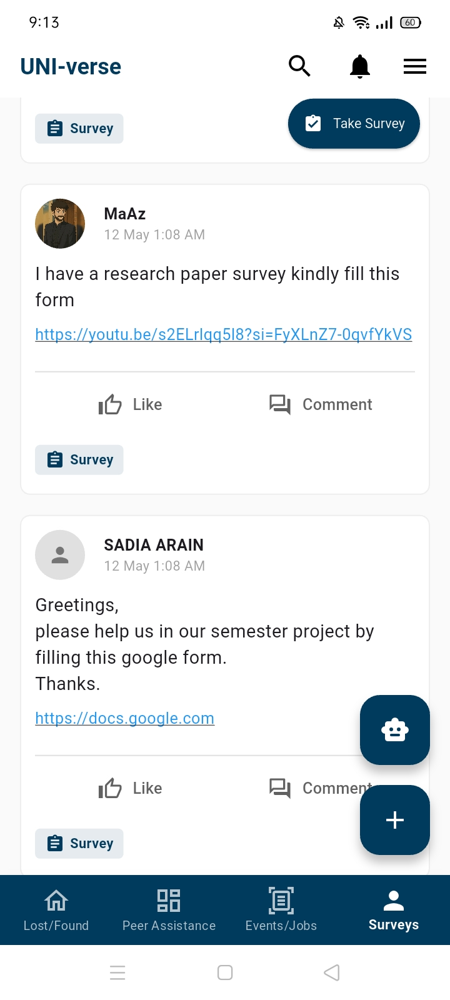
   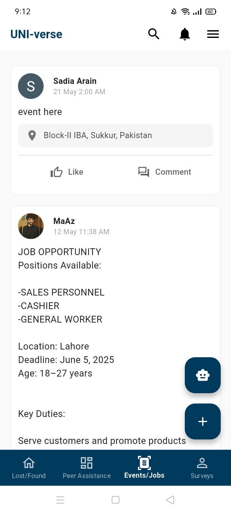
</p>
---

## 🔧 Setup Instructions

### 📋 Prerequisites
- Flutter SDK (latest stable)
- Firebase project with Auth, Firestore, and Storage
- Cloudinary account
- Android Studio or VSCode

### 🧑‍💻 Clone the Repository

```bash
git clone https://github.com/HafsaQureshi1/UNI-verse.git
cd UNI-verse
```

### 📦 Install Dependencies

```bash
flutter pub get
```

### 🔐 Configure Firebase

1. Create a Firebase Project  
2. Enable Google Sign-In, Firestore, FCM, and Storage  
3. Download and place `google-services.json` (Android) 
4. Set Firestore security rules

### 🖼️ Configure Cloudinary

Create a `.env` file or use secure secrets manager:
```env
CLOUDINARY_CLOUD_NAME=your_cloud_name
CLOUDINARY_API_KEY=your_api_key
CLOUDINARY_API_SECRET=your_api_secret
```

### 🔒 Enable 2FA (Optional but Secure)
- Go to Firebase Console > Authentication > Multi-Factor Authentication
- Enable SMS-based second factor
- Update your sign-in flow

### ▶️ Run the App

```bash
flutter run
```

---


## 📦 Deployment

- **Android**: Use `flutter build apk --release` or `flutter build appbundle`


---

## 👥 Team Contributions

### **Hafsa Waseem**  
🔹 **Role:** Full-Stack Lead  
🔹 **Work:**  
   - Designed and built the entire application  
   - Implemented frontend, backend, and AI components  

### **Maaz Bin Hassan**  
🔹 **Role:** Frontend and UI Support  
🔹 **Work:**  
   - Helped clean and refine UI elements  
   - Implemented Survey creation
     
### **Sadia Athar**  
🔹 **Role:** Frontend Helper  
🔹 **Work:**  
   - Assisted with basic frontend tasks  

## 🤝 Contributing

Contributions are welcome!  
To contribute:

1. Fork the repo  
2. Create your feature branch: `git checkout -b feature/your-feature`  
3. Commit your changes: `git commit -m 'Add feature'`  
4. Push to the branch: `git push origin feature/your-feature`  
5. Open a Pull Request


## 🙏 Acknowledgements

- Firebase by Google  
- Cloudinary  
- Testers and Students who helped shape the app
